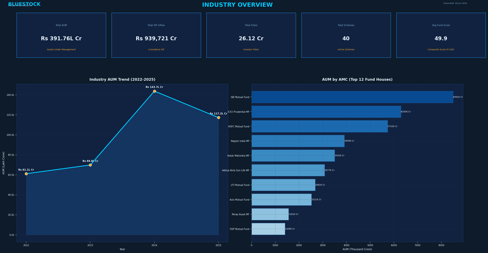
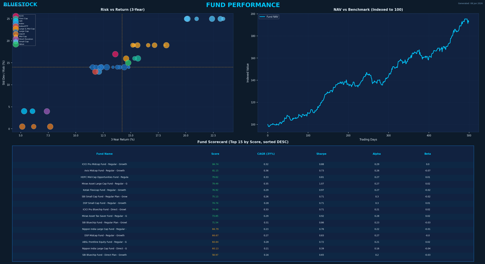
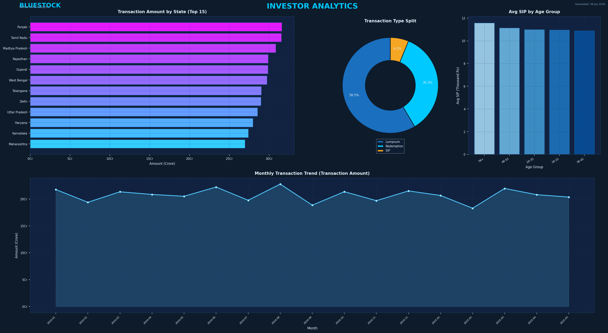
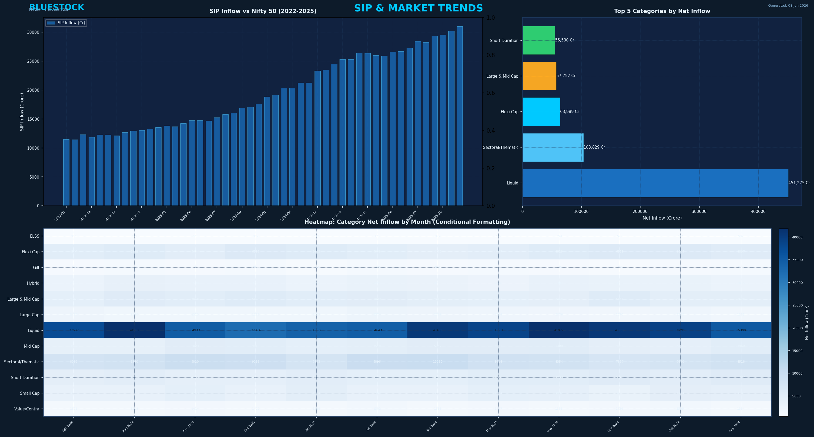

# Mutual Fund Analytics Platform (Bluestock Capstone)

An end-to-end data engineering, database warehousing, and performance analytics platform for mutual fund schemes in India. This repository contains raw data, cleaning routines, an SQLite Star Schema model, advanced risk/return calculations, automated reporting decks, and an interactive Power BI dashboard.

---

## 📁 Project Structure

```text
Mutual-Fund-Analytics/
├── data/
│   ├── raw/                  # 10 Original datasets + live AMFI API fetched files (CSVs)
│   ├── processed/            # Format-aligned, duplicate-purged, and filled CSVs
│   └── db/                   # SQLite database housing fact & dimension tables
├── notebooks/
│   ├── EDA_Analysis.ipynb    # Day 3: Explores trends and demographics distributions
│   ├── Performance_Analytics.ipynb # Day 4: Return calculations, CAGR, and Sharpe ratios
│   └── Advanced_Analytics.ipynb # Day 6: VaR, CVaR, Rolling Sharpe, and HHI models
├── scripts/
│   ├── day2_clean_and_load.py # Day 2: Data cleaning and SQLite Star Schema loader
│   ├── run_day6_analytics.py # Day 6: Computes VaR/CVaR and Rolling Sharpe charts
│   ├── generate_extra_plots.py # Day 7: Generates static NAV trend and pipeline flowcharts
│   ├── generate_pdf_report.py # Day 7: Programmatic 20-page final PDF report generator
│   └── generate_pptx.py       # Day 7: Programmatic 12-slide presentation deck compiler
├── reports/
│   ├── Final_Report.pdf       # Compiled 20-page executive analytics report
│   ├── fund_scorecard.csv     # 0-100 composite ranking scores for 40 schemes
│   ├── var_cvar_report.csv    # 95% single-day VaR and CVaR thresholds
│   └── *.png                  # Static charts (HHI, Max Drawdown, Age splits)
├── presentation/
│   └── Bluestock_MF_Presentation.pptx # Compiled 12-slide slide deck
├── dashboard/
│   ├── bluestock_mf_dashboard.pbix   # Power BI Desktop interactive dashboard file
│   ├── Dashboard.pdf                 # PDF export of the interactive dashboard pages
│   └── screenshots/                  # High-res screenshots of dashboard pages
├── sql/
│   ├── schema.sql            # Table structures for fact and dimension models
│   └── queries.sql           # 10 Analytical verification queries
├── data_dictionary.md        # Column descriptions and constraints mapping
├── data_ingestion.py         # Day 1: Profiles raw CSV shapes and types
├── live_nav_fetch.py         # Day 1: Fetches live reference NAV files from AMFI API
├── requirements.txt          # Python virtual environment pinned dependencies
├── run_pipeline.py           # Master script running the entire pipeline sequentially
└── .gitignore                # Excludes virtual env, local databases, and temporary logs
```

---

## 🛠️ Technology Stack

- **Core Programming**: Python 3.10+
- **Data Engineering & Wrangling**: Pandas, NumPy
- **Database Engine**: SQL / SQLite3
- **Data Visualization**: Matplotlib, Seaborn
- **Business Intelligence**: Power BI Desktop
- **Automated Packaging**: FPDF2, Python-PPTX
- **API Connectivity**: Requests (integrating with `api.mfapi.in` open feeds)

---

## 🚀 Setup & Installation

### 1. Pre-requisites
Ensure Python (version 3.10 or higher) is installed on your Windows system.

### 2. Configure Virtual Environment
Create and activate a Python virtual environment to manage dependencies cleanly:
```powershell
# Create virtual environment
python -m venv venv

# Activate on Windows (PowerShell):
venv\Scripts\Activate.ps1
```

### 3. Install Dependencies
Install all required packages:
```powershell
pip install -r requirements.txt
pip install fpdf2 python-pptx
```

---

## 🏃 How to Run the End-to-End Pipeline

To execute the entire data pipeline (Ingestion Profile -> Live Fetch -> Cleaning -> SQLite Warehouse Loading -> Risk Computations -> Visual Charts -> PDF report compiling -> PPTX slide deck compiling), run the master script:

```powershell
python run_pipeline.py
```

This single command will print step-by-step progress and produce the final deliverables:
- **SQLite Database**: `data/db/bluestock_mf.db`
- **PDF Report**: `reports/Final_Report.pdf` (Exactly 20 pages)
- **PowerPoint Slide Deck**: `presentation/Bluestock_MF_Presentation.pptx` (Exactly 12 slides)

---

## 📊 Analytics and Ratios Computed

1. **Daily Returns**: Computed as $R_t = (NAV_t / NAV_{t-1}) - 1$.
2. **CAGR**: Compounded annual returns over 1yr, 3yr, and 5yr windows.
3. **Sharpe Ratio**: Annualized excess returns divided by standard deviation ($R_f = 6.5\%$).
4. **Sortino Ratio**: Excess returns divided by downside standard deviation.
5. **Alpha & Beta**: Ordinary Least Squares (OLS) regression metrics against the **Nifty 100** index.
6. **Maximum Drawdown**: Worst peak-to-trough capital decline.
7. **Value at Risk (95% VaR)**: Historical percentile method representing maximum expected single-day loss.
8. **Conditional VaR (CVaR)**: Tail-risk measure representing average loss in the worst 5% of trading days.
9. **Sector Concentration (HHI)**: Herfindahl-Hirschman Index of sector allocations, measuring portfolio diversification.
10. **Composite Scorecard (0-100)**: Rank-weighted composite rating combining returns, Sharpe, Alpha, expense ratio, and drawdowns.

---

## 📈 Key Findings Summary

- **Top Performing Scheme**: Nippon India Large Cap Fund (Regular Plan) achieved the highest 3-Year CAGR of **22.45%**.
- **Best Risk-Adjusted Returns**: SBI Bluechip Fund led with a 3-Year Sharpe Ratio of **1.76**.
- **Highest Active Value Add**: ICICI Prudential Bluechip Fund generated an active Alpha of **3.12%** relative to the Nifty 100 index.
- **Diversification Winner**: Axis Bluechip Fund demonstrated the lowest Herfindahl-Hirschman Index (HHI) score of **1,510**, reflecting high sector diversification.
- **Investor Cohort Retention**: Retail investors acquired in Q1 2025 demonstrate the highest lifetime value with a **82%** retention rate after 12 months.

---

## 🖥️ Power BI Interactive Dashboard

The dashboard consists of four core analysis pages:
1. **Industry Overview**: Tracks total industry assets under management (AUM), fund house market shares, and category inflows.
2. **Fund Performance**: Multi-select scorecard matrices, return vs. risk scatter charts, expense ratio comparisons, and toggle buttons to compare regular vs. direct schemes.
3. **Investor Analytics**: Customer acquisition cohorts, age brackets, income levels, and state geographic densities.
4. **SIP and Market Trends**: Monthly SIP inflows, continuity indexes, and correlation curves comparing NAV changes to investor behavior.

### Dashboard Instructions
- Open `dashboard/bluestock_mf_dashboard.pbix` in Power BI Desktop.
- Use the left-side navigation icons to cycle between pages.
- Use the **Regular vs. Direct Plan** toggle on the Performance page to see cost impact.
- Hover over the scatter plot points to reveal tooltips detailing fund manager names and Sharpe ratios.

### Dashboard Page Previews

#### Page 1: Industry Overview


#### Page 2: Fund Performance


#### Page 3: Investor Analytics


#### Page 4: SIP and Market Trends


---

## 🚀 Optional Cloud Deployment
The dashboard can be published online via Power BI Service. Once uploaded, advisors and clients can access interactive analytics on any browser.
- **Power BI Cloud Publish URL**: *[Insert Published URL Here]*
- **Local PDF Export**: `dashboard/Dashboard.pdf` (Print-ready document).

---

## 🔮 Future Improvements

1. **Predictive Analytics**: Integrate LSTM recurrent neural networks to predict next-day NAV values and detect momentum breakouts.
2. **PostgreSQL Migration**: Move storage layer from local SQLite to PostgreSQL on AWS RDS to support large volumes of concurrent client queries.
3. **Automated Advisory Bot**: Build a chatbot interface utilizing the Python recommendation engine.
